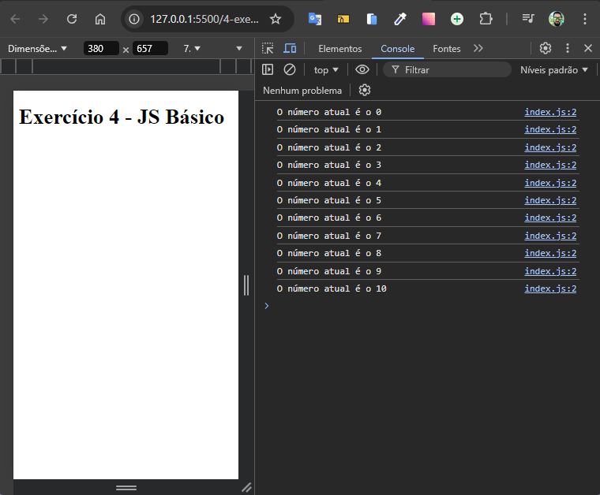

# Contador de Números

Desenvolvido como exercício de JavaScript básico do curso de extensão universitária do DevQuest - Dev em Dobro.

Tratasse de uma aplicação simples de contador de números desenvolvida com HTML e JavaScript. O contador básicamente pega o número inicial "0" e vai incrementar o valor exibido em "1" até chegar no número "10".



## Tecnologias Utilizadas

- **HTML**
- **JavaScript**

## Como Usar

1. Clone este repositório:

   ```bash
   git clone https://github.com/Alberesbass/contador-de-numeros.git
   ```

2. Abra o arquivo `index.html` em seu navegador para utilizar o contador de números.

## Licença

Este projeto está sob a licença MIT. Consulte o arquivo [LICENSE](./LICENSE) para mais informações.

---

Desenvolvido por [Alberes](https://github.com/Alberesbass)